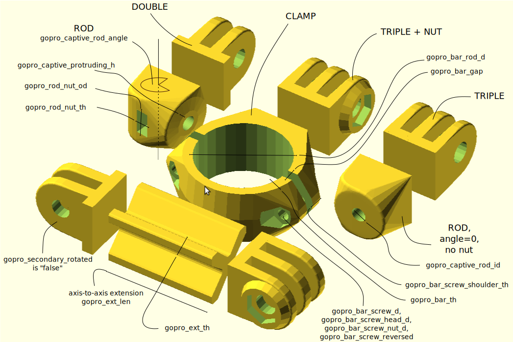

This is the **official** and popular "GoPro customizable mounts, and a library to expand"

It is an openscad script than can generate all sorts of custom gopro mounts. This is useful both when space is a constraint and to improve stiffness over complicated multipart "official" gopro linked mount bits.

You can use Thingiverse "customizer" (when it works) to generate all sorts of shapes to suit your needs.

Licence is CC-BY-NC 2013 by jeremie.francois@gmail.com

  * https://www.linkedin.com/in/jeremiefrancois/
  * https://www.thingiverse.com/thing:62800
  * Make yours with https://www.thingiverse.com/apps/customizer/run?thing_id=62800
  * https://www.tridimake.com

It slices neatly with the following parameters

  * 0.1 mm layers (for better look & more compact FDM) -- 0.15 is still OK (and faster)
  * 0.8 mm walls (loops->infill->perimeters)
  * 0.8 mm bottom/top
  * 100% fill (probably safer, though 30% is quite OK)

Better use PETG instead of PLA for heat resistance.

History
  * Rev 1.2: added vvertical angle option for extension, free head rotation and rounded baseplate when needed
  * Rev 1.1: added horizontal angle option for extension
  * Rev 1.03: examples and first release (20130317-1234)
  * Rev 1.02: added handle/bar mount and rounded the angles of the rod mount
  * Rev 1.01: fixed printing angle vs captive nut slot, added a slight freeplay

